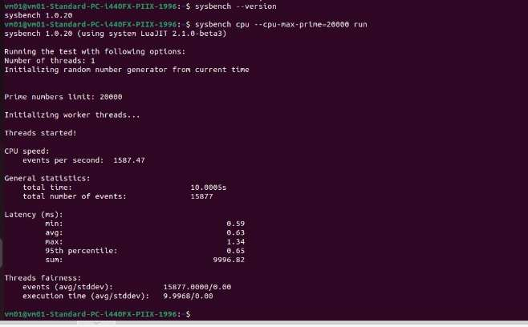
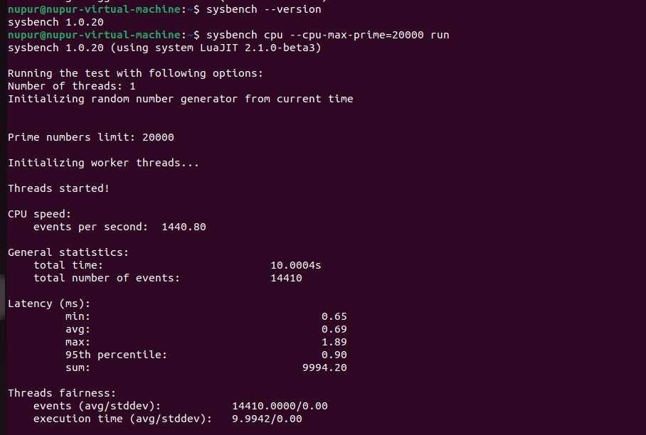
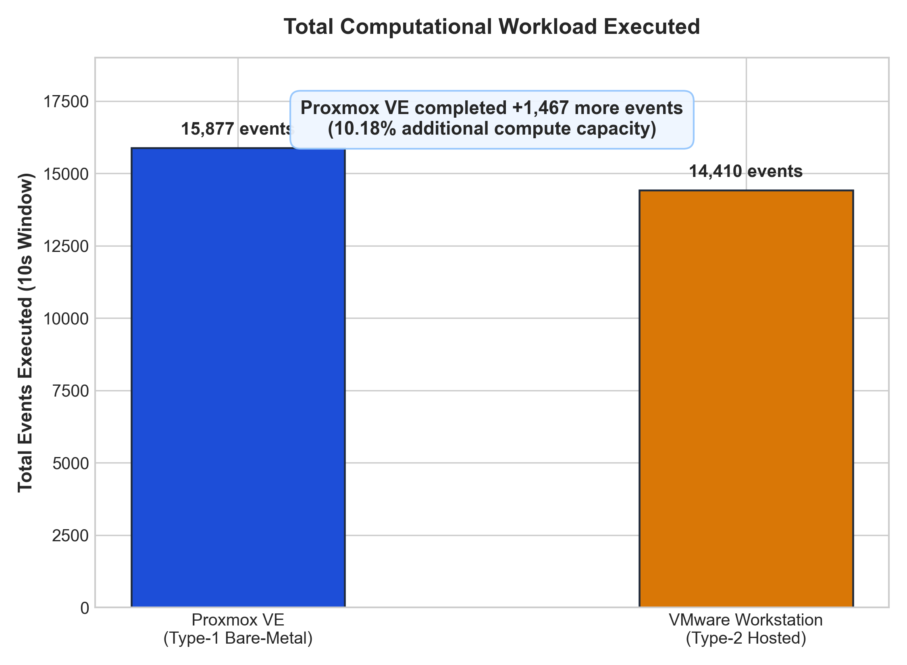
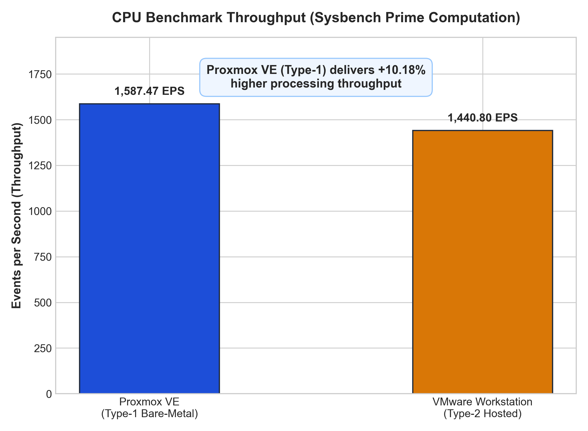
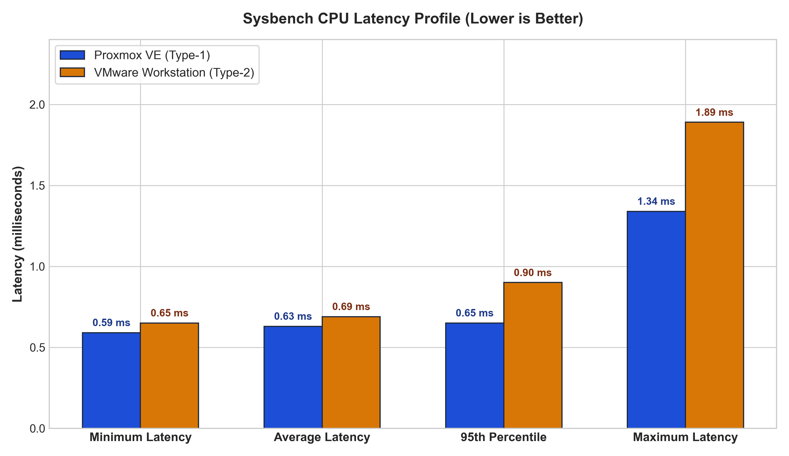
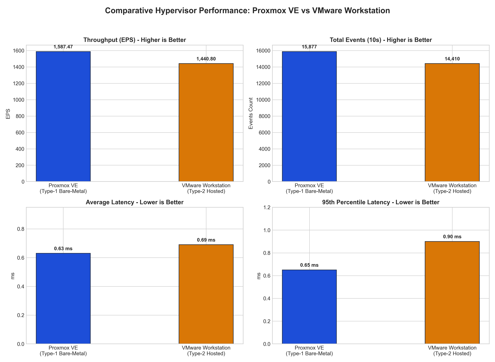

# Cloud Computing - Hypervisor Performance Analysis

---

## Table of Contents
1. [Project Objectives](#1-project-objectives)
2. [Hypervisor Architectural Comparison](#2-hypervisor-architectural-comparison)
3. [Virtual Machine Specifications](#3-virtual-machine-specifications)
4. [Experimental Procedure & Pre-Setups](#4-experimental-procedure--pre-setups)
5. [Sysbench Screenshot Comparison](#5-sysbench-screenshot-comparison)
6. [Performance Comparison Table](#6-performance-comparison-table)
7. [Graphs](#7-graphs)
8. [Takeaway & Conclusion](#8-takeaway--conclusion)
9. [Repository Structure](#9-repository-structure)
10. [How To Run](#10-how-to-run)

---

## 1. Project Objectives
The primary objectives of this Cloud Computing laboratory experiment are:
1. **Deployment**: Provision two identical Ubuntu Virtual Machines across different hypervisor architectures:
   - **Type-1 (Bare-Metal)**: Proxmox VE
   - **Type-2 (Hosted)**: VMware Workstation Pro
2. **Standardization**: Enforce uniform hardware resource allocations to ensure direct comparability.
3. **Benchmarking**: Execute the `sysbench` CPU computational benchmark using 20,000 prime numbers to stress test CPU virtualization efficiency.
4. **Metric Collection**: Capture execution time, total events processed, throughput (events/sec), and latency statistics.
5. **Architectural Evaluation**: Quantify the performance overhead introduced by host operating system abstraction layers in Type-2 hypervisors versus bare-metal hypervisor execution.

---

## 2. Hypervisor Architectural Comparison

### Type-1 Hypervisor (Proxmox VE - Bare-Metal)
- **Architecture**: Operates directly on the physical server's hardware.
- **Mechanism**: Utilizes the Linux kernel integrated with KVM. Guest VM instructions execute directly on the hardware's CPU extensions.
- **Impact**: Minimal hypervisor interception eliminates heavy delays, offering native-like performance.

### Type-2 Hypervisor (VMware Workstation - Hosted)
- **Architecture**: Operates as a software application on top of an existing host OS (e.g., Windows).
- **Mechanism**: Privileged guest CPU operations undergo a double translation process through the VMware engine and the host OS kernel.
- **Impact**: The host OS scheduler introduces thread preemptions as the VM competes with background desktop services, leading to higher baseline latency.

```text
       Type-1: Proxmox VE (Bare-Metal)               Type-2: VMware Workstation (Hosted)
  ┌─────────────────────────────────────────┐   ┌─────────────────────────────────────────┐
  │     Ubuntu 22.04 VM (Sysbench Workload) │   │     Ubuntu 22.04 VM (Sysbench Workload) │
  ├─────────────────────────────────────────┤   ├─────────────────────────────────────────┤
  │   KVM / QEMU Virtual Hardware Layer     │   │   VMware Virtual Hardware Engine        │
  ├─────────────────────────────────────────┤   ├─────────────────────────────────────────┤
  │   Proxmox VE Hypervisor Core (Debian)   │   │   Host Operating System (Windows 11)    │
  ├─────────────────────────────────────────┤   ├─────────────────────────────────────────┤
  │       Physical Bare-Metal Hardware      │   │       Physical Bare-Metal Hardware      │
  └─────────────────────────────────────────┘   └─────────────────────────────────────────┘
```

---

## 3. Virtual Machine Specifications
To guarantee scientific accuracy and eliminate resource skewing, identical configurations were assigned to both VMs during setup:

| Resource Parameter | Proxmox VE (Type-1) | VMware Workstation (Type-2) | 
| :--- | :--- | :--- | 
| **VM Name** | `vm01-type01` | `nupur-virtual-machine` | 
| **Guest OS** | Ubuntu 22.04.5 LTS (x86_64) | Ubuntu 22.04.5 LTS (x86_64) | 
| **CPU Allocation**| 2 vCPU (1 Socket, 2 Cores) | 2 vCPU (1 Processor, 2 Cores) | 
| **RAM Allocation**| 2048 MiB (2.0 GB) | 2048 MB (~2.0 GB) | 
| **Virtual Disk** | 20.0 GB (`local-lvm`) | 20.0 GB (Single File) | 
| **Network Adapter**| Bridge (`vmbr0`) | NAT (`VMnet8`) | 
| **Benchmark Tool** | `sysbench` | `sysbench` | 

---

## 4. Experimental Procedure & Pre-Setups

### Part A: Type-1 Hypervisor Setup (Proxmox VE)
1. **Access**: Logged into the Proxmox VE web interface via `https://<PROXMOX_SERVER_IP>:8006`.
2. **VM Creation Stages**: `General -> OS -> System -> Disks -> CPU -> Memory -> Network -> Confirm`
3. **Configuration**: 
   - **OS**: Selected `ubuntu-22.04.5.iso` from local storage.
   - **Disks**: Allocated 20 GB on `local-lvm`.
   - **CPU**: 1 Socket, 2 Cores (Total 2 vCPU).
   - **Memory**: 2048 MiB.
   - **Network**: Assigned to `vmbr0` bridge.
4. **Installation**: Started the VM, opened the Console, and completed the standard Ubuntu Normal Installation.
5. **Verification**: Verify 2 Cores, 2GB RAM, and 20GB Disk:
   ```bash
   hostnamectl # Displays system hostname and detailed OS/kernel metadata
   lscpu       # Lists CPU architecture details (cores, threads, sockets, cache sizes)
   free -h     # Shows total, used, and available RAM/Swap in human-readable units
   df -h       # Displays disk space usage across mounted filesystems
   ```

### Part B: Type-2 Hypervisor Setup (VMware Workstation)
1. **Access**: Launched VMware Workstation and selected "Create a New Virtual Machine" (Typical Configuration).
2. **Configuration**:
   - **OS**: Mounted `ubuntu-22.04.5.iso`.
   - **Disks**: Set Maximum Disk Size to 20 GB (Stored as a single file).
   - **Hardware Customization**: Set Memory to 2048 MB, Processors to 1 (with 2 Cores), and Network Adapter to NAT.
3. **Installation**: Powered on the VM and completed the standard Ubuntu Normal Installation.
4. **Verification**: Executed the same terminal commands (`lscpu`, `free -h`, `df -h`) to confirm the identical allocation of hardware resources.

### Part C: Benchmark Execution
On both machines, the following commands were executed to run the test:
```bash
sudo apt update                       # Refreshes the local package index
sudo apt install sysbench -y          # Installs the sysbench benchmarking tool
sysbench cpu --cpu-max-prime=20000 run # Benchmarks CPU performance by calculating prime numbers up to 20,000
```

---

## 5. Sysbench Screenshot Comparison

Raw console verification of the benchmark results:

* **Proxmox VE Output:**  
  

* **VMware Workstation Output:**  
  

---

## 6. Performance Comparison Table

The table below summarizes the exact values recorded during the benchmark:

# Hypervisor Performance Comparison

| Performance Metric | Proxmox VE (Type-1) | VMware Workstation (Type-2) | Delta | Percentage Change | Winner |
| :--- | :--- | :--- | :--- | :--- | :--- |
| **Execution Time** | 10.0005 sec | 10.0004 sec | +0.0001 sec | — | — |
| **Total Events** | 15,877 | 14,410 | +1,467.00 | +10.18% | **Proxmox VE** |
| **Events / sec** | 1,587.47 | 1,440.80 | +146.67 | +10.18% | **Proxmox VE** |
| **Min Latency (ms)** | 0.59 | 0.65 | -0.06 | -9.23% | **Proxmox VE** |
| **Avg Latency (ms)** | 0.63 | 0.69 | -0.06 | -8.70% | **Proxmox VE** |
| **Max Latency (ms)** | 1.34 | 1.89 | -0.55 | -29.10% | **Proxmox VE** |

---

### Key Takeaway

Proxmox VE (Type-1) outperformed VMware Workstation (Type-2) across all metrics, achieving **10.18% higher throughput** and **8.70% lower average latency**, with **29.10% lower peak latency spikes**.

---

## 7. Graphs

### Total Events Comparison


### Events per Second Comparison


### Latency Comparison


### Overall Performance Dashboard


---

## 8. Takeaway & Conclusion

#### 1. CPU Throughput

##### Results
- Proxmox VE: **15,877 events / 10s ≈ 1,587.47 events/s**
- VMware Workstation: **14,410 events / 10s ≈ 1,440.80 events/s**
- Proxmox achieved **10.18% higher throughput**.

##### Technical Reason
- Proxmox runs directly on the hardware using KVM, avoiding the additional desktop host-OS layer present in VMware Workstation.

#### 2. Latency

##### Results
- Proxmox VE: **0.63 ms average**
- VMware Workstation: **0.69 ms average**
- 95th Percentile Latency: **0.65 ms vs 0.90 ms**
- Maximum latency: **1.34 ms vs 1.89 ms**, showing significantly larger latency spikes in the VMware setup.

#### 3. Why the Difference?

##### Technical Explanation
- In VMware Workstation, the VM runs as a process managed by the **Windows host OS**.
- CPU scheduling, memory management, I/O, and host background processes introduce additional overhead and contention.
- Proxmox's KVM-based architecture provides a direct virtualization path to the physical hardware with Ring 0 scheduler execution.

#### 4. Conclusion

##### Key Findings
- The experiment demonstrates that **Proxmox performed better under this specific workload and configuration**.
- It proves that bare-metal virtualization reduces translation tax and delivers tighter tail-latency consistency.
- Proxmox is designed for **server and data-center virtualization**, while VMware Workstation is primarily designed for **desktop development, testing, and labs**.

#### Engineering Recommendation
* **Use Type-1 Hypervisors (Proxmox VE, ESXi):** Ideal for cloud infrastructure, enterprise data centers, and heavy computational workloads.
* **Use Type-2 Hypervisors (VMware Workstation, VirtualBox):** Ideal for local desktop development, software testing, and educational environments.

---

## 9. Repository Structure

```text
CC-Experiment-01-Hypervisor-Analysis/
│
├── results/
│   └── performance-analysis.md
│
├── screenshots/
│   │
│   ├── comparison/
│   │   ├── events_per_second_comparison.png
│   │   ├── latency_comparison.png
│   │   ├── overall_performance_dashboard.png
│   │   └── total_events_comparison.png
│   │
│   ├── type1-proxmox/
│   │   ├── 01-proxmox-dashboard.jpeg
│   │   ├── 02-proxmox-vm-configuration.jpeg
│   │   ├── 03-proxmox-vm-running.jpeg
│   │   ├── 04-proxmox-ubuntu-console.jpeg
│   │   ├── 05-01-proxmox-system-configuration.png
│   │   ├── 05-02-proxmox-system-configuration.png
│   │   ├── 06-proxmox-sysbench-result.png
│   │   ├── 07-01-proxmox-resource-monitoring.png
│   │   ├── 07-02-proxmox-resource-monitoring.png
│   │   └── 07-03-proxmox-resource-monitoring.png
│   │
│   └── type2-vmware/
│       ├── 01-vmware-vm-configuration.png
│       ├── 02-vmware-vm-running.png
│       ├── 03-vmware-system-configuration.jpeg
│       └── 04-vmware-sysbench-result.jpeg
│
├── scripts/
│   ├── benchmark.sh
│   ├── generate_plots.py
│   └── parse_sysbench.py
│
└── README.md
```

---

## 10. How To Run

- Make `benchmark.sh` executable and run it:
```bash
chmod +x CC-Experiment-01-Hypervisor-Analysis/scripts/benchmark.sh
./CC-Experiment-01-Hypervisor-Analysis/scripts/benchmark.sh
```

- Run `parse_sysbench.py` to compare benchmark outputs:
```bash
python CC-Experiment-01-Hypervisor-Analysis/scripts/parse_sysbench.py
```

- To run `generate_plots.py`:
  - Pre-installation:
    ```bash
    pip install matplotlib numpy
    ```
  - Execution:
    ```bash
    python CC-Experiment-01-Hypervisor-Analysis/scripts/generate_plots.py
    ```
